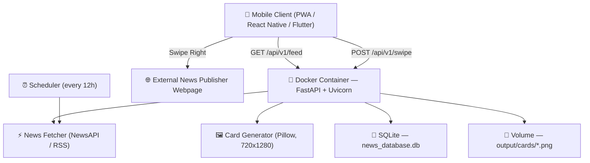

# Paperswap

**Swipe your news. Improve your reading experience.**

Paperswap is a mobile optimized news discovery platform that borrows the Tinder interaction model for reading headlines. Instead of scrolling an endless list, you get one visual card at a time:

- 👉 **Swipe right**  Interested. Opens the full article on the publisher's site.
- 👈 **Swipe left**  Pass. The card animates away and the next headline appears.

This repository contains the **Dockerized FastAPI backend** that fetches live news, renders portrait card graphics, deduplicates articles, logs swipes, and serves everything to mobile clients over a REST API, plus a **touch-enabled mobile web preview** you can open on your phone browser without installing anything.

---

##  Project Goals

| Goal | What it means in practice |
| --- | --- |
| **Visual-first headlines** | Every article becomes a rendered 720×1280 portrait card, readable at a glance. |
| **Always fresh, never repeated** | Background scheduler refreshes news every 12 hours |
| **Backend that any client can use** | A clean REST API so a PWA, React Native app, or Flutter app can all consume the same feed. |
| **Deploy anywhere in one command** | Fully containerized, the same image runs locally and on Render, Railway, Fly.io, AWS App Runner, or DigitalOcean. |
| **Learn from behaviour** | Swipes are logged so the feed can be personalised in future iterations. |

---

## Architecture



### How a card is born

1. **Fetch**, `news_fetcher.py` pulls up to 50 articles per batch and generates a short summary for each.
2. **Deduplicate**, an MD5 hash of `title + url` is checked against SQLite. Known articles are dropped before any work is wasted.
3. **Render**, `card_generator.py` uses Pillow to compose a 9:16 vertical PNG (720×1280) into `output/cards/`.
4. **Serve**, `main.py` exposes the card metadata, image URL, and source link through the REST API.
5. **Learn**, the client posts each swipe back to `/api/v1/swipe` for tracking.

### Tech stack

**Backend:** Python 3.12 · FastAPI · Uvicorn · Pillow · SQLite
**Frontend (preview):** HTML5 + CSS + vanilla JS touch gesture engine
**Infrastructure:** Docker (multi-stage, `python:3.12-slim`) 

---

## 📁 Folder Structure

```
Paperswap/
├── README.md                     # This file
├── walkthrough.md                # Detailed setup, architecture & feature notes
│
├── backend/
│   ├── main.py                   # FastAPI app, REST endpoints, CLI runner
│   ├── database.py               # SQLite engine, deduplication, swipe tracking
│   ├── news_fetcher.py           # News/RSS ingestion + summary generation
│   ├── card_generator.py         # Pillow 9:16 portrait card renderer
│   ├── requirements.txt          # Python dependencies
│   ├── Dockerfile                # Multi-stage production image
│   ├── docker-compose.yml        # Local orchestration + env config
│   ├── news_database.db          # SQLite store (gitignored)
│   │
│   ├── templates/
│   │   └── mobile_preview.html   # Touch swipe mobile UI (served at /mobile)
│   │
│   └── output/
│       └── cards/                # Generated 9:16 PNG cards (volume-mounted)
│
└── android/                       # Current version of mobile client (v3)
    ├── app/
    │   └── src/
    │       └── main/
    │           └── java/com/paperswap/
    │               ├── MainActivity.kt
    │               └── ...
    └── build.gradle
```

---

##  Getting Started

### Option 1 - Docker Compose (recommended)

```bash
cd backend
docker-compose up --build
```

### Option 2 - Local Python

```bash
cd backend
pip install -r requirements.txt
python main.py
```

Then open:

| URL | What you get |
| --- | --- |
| `http://localhost:8000/mobile` | 📱 Tinder-style swipe app (open this on your phone) |
| `http://localhost:8000` | 🖼 Gallery dashboard of all generated cards |
| `http://localhost:8000/docs` | 📖 Interactive OpenAPI documentation |

### Configuration

Set these in `docker-compose.yml` or your local environment:

| Variable | Description | Default |
| --- | --- | --- |
| `NEWS_API_KEY` | API key for the news provider | _required_ |
| `REFRESH_INTERVAL` | Seconds between background refreshes | `43200` (12h) |

---

##  API Reference

| Method | Endpoint | Description |
| --- | --- | --- |
| `GET` | `/api/v1/feed` | Paginated list of cards with metadata, image URLs, and article links |
| `GET` | `/api/v1/feed/next` | The next unviewed card for the current session |
| `POST` | `/api/v1/cards/refresh` | Trigger card generation as a background task |
| `POST` | `/api/v1/swipe` | Log a swipe action (`left` / `right`) for a card |

---

##  Project Visibility & Progress

**Paperswap is developed in the open.** Anyone can see exactly what is built, what is in progress, and what is broken.

| Where | What you'll find there |
| --- | --- |
| **[Issues](../../issues)** | Every bug, feature request, and task. Nothing is worked on that isn't an issue first. |
| **[Project Board](../../projects)** | Kanban view: `Backlog → In Progress → In Review → Done`. The live state of the project. |
| **[Milestones](../../milestones)** | Work grouped by phase, with completion percentage and target dates. |
| **[Pull Requests](../../pulls)** | Code under review, each linked to the issue it closes. |
| **[Discussions](../../discussions)** | Open design questions and proposals before they become issues. |


## 🤝 Contributing

In case you want to contribute to the project, please send an email to request access to the mate.kovasznai@gmail.com email address. All contributors are welcome to submit pull requests, report bugs, or suggest features.

