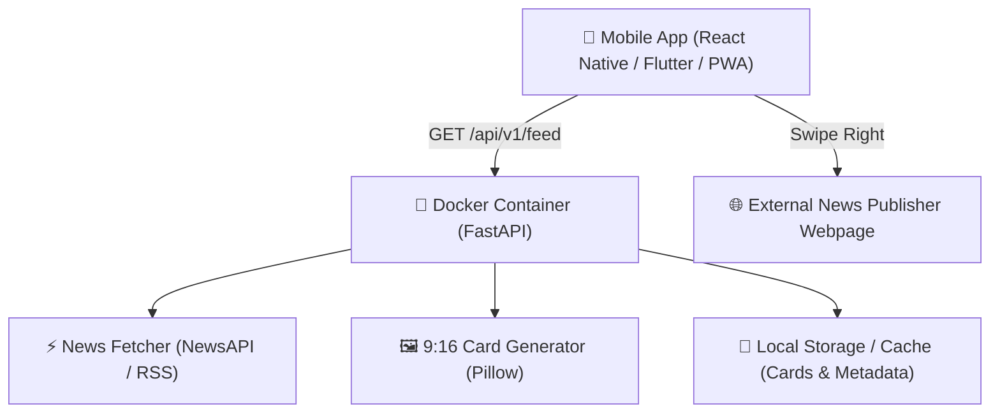

# Project Plan: Tinder-Style Tech & Finance News Mobile App (Dockerized Backend)

A mobile news discovery platform featuring a **swipe-based interface** (Tinder UX model). Users view 9:16 portrait visual cards one at a time:
- 👉 **Swipe Right**: Interested / Read — Directs user to the full news article URL.
- 👈 **Swipe Left**: Pass / Skip — Dismisses card and seamlessly reveals the next headline.

The backend is fully **Dockerized** to serve card metadata, pre-rendered 9:16 card graphics, and live news updates to mobile clients via REST APIs.

---

## 🏗 System Architecture & Technology Stack

### 1. Backend Service (`backend/`)
- **Framework**: Python 3.12 + FastAPI + Uvicorn
- **Card Processing**: Pillow (PIL) generating 9:16 vertical portrait cards (720x1280 px)
- **Background Tasks**: Automated background scheduler to fetch fresh news and update cards every 3 hours
- **Containerization**: Multi-stage `Dockerfile` + `docker-compose.yml`

### 2. Mobile Phone Frontend (`mobile/` or web mobile client)
- **UI Framework**: React Native (Expo) or Flutter or PWA (HTML5 Touch Swipe Engine)
- **Gestures**: Smooth spring animation swipe cards (PanResponder / Framer Motion / react-native-deck-swiper)
- **Action Handlers**:
  - Right Swipe -> In-App Browser / System Browser open `article.url`
  - Left Swipe -> Animate card out & increment feed queue index

---

## 📋 Proposed Implementation Phases

### Phase 1: Dockerize Backend API Service (`backend/`)

#### [NEW] [Dockerfile](file:///c:/Users/matek_yulq090/Desktop/Antigrav_test/backend/Dockerfile)
- Multi-stage lightweight Python 3.12-slim Dockerfile.
- Installs system dependencies (`libpng`, `freetype`, `fonts-dejavu` for font rendering).
- Exposes port `8000` and configures production Uvicorn server.

#### [NEW] [docker-compose.yml](file:///c:/Users/matek_yulq090/Desktop/Antigrav_test/backend/docker-compose.yml)
- Environment variable configuration (`NEWS_API_KEY`, `REFRESH_INTERVAL`).
- Persistent volume mapping for `./output/cards`.

#### [MODIFY] [main.py](file:///c:/Users/matek_yulq090/Desktop/Antigrav_test/backend/main.py)
- Expand REST API endpoints for mobile consumption:
  - `GET /api/v1/feed`: Paginated list of 9:16 cards with metadata, image URLs, and article links.
  - `GET /api/v1/feed/next`: Returns the next unviewed news card item.
  - `POST /api/v1/cards/refresh`: Triggers manual or automated card generation background task.

---

### Phase 2: Interactive Mobile Swipe Web Preview / Client (`mobile/`)

#### [NEW] [mobile_preview.html](file:///c:/Users/matek_yulq090/Desktop/Antigrav_test/backend/templates/mobile_preview.html)
- Touch-enabled mobile phone preview built into the FastAPI backend (`http://localhost:8000/mobile`).
- Real-time gesture engine supporting:
  - Touch/Mouse drag left & right with rotation feedback.
  - Green "READ" badge overlay on right drag; Red "SKIP" badge overlay on left drag.
  - Auto redirect to source article on right swipe.
  - Counter showing remaining cards out of 20.

---

### Phase 3: Cloud Deployment Guide

Documentation on deploying the Docker container to popular cloud providers:
- **Render / Railway / Fly.io**: Single command deploy from Dockerfile.
- **AWS App Runner / DigitalOcean App Platform**: Deploy container image directly with environment variables.

---

## ❓ Open Design Decisions for User Review

> [!IMPORTANT]
> 1. **Mobile Frontend Preference**: Would you prefer us to build an **interactive mobile web app preview (PWA/HTML5 Touch Swipe UI)** that you can immediately test on your phone browser, OR setup a **React Native / Expo** mobile project boilerplate?
> 2. **Cloud Provider**: Do you have a preferred cloud host for the Docker container (e.g. Render, Railway, AWS, DigitalOcean, Fly.io)?
