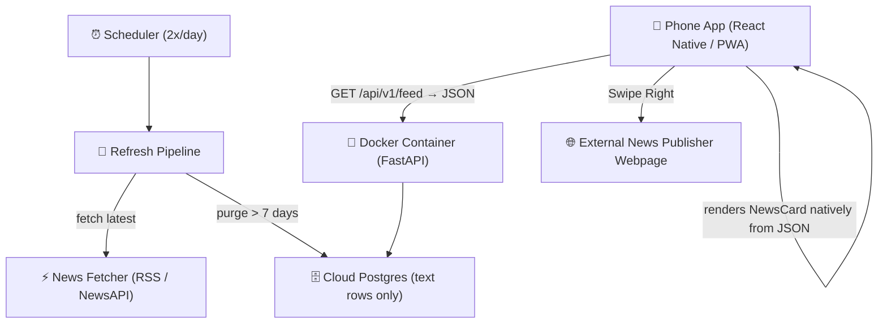

# Project Plan: Tinder-Style Tech & Finance News Mobile App

A mobile news discovery platform featuring a **swipe-based interface** (Tinder UX model). Users view portrait news cards one at a time:
- 👉 **Swipe Right**: Interested / Read — Directs user to the full news article URL.
- 👈 **Swipe Left**: Pass / Skip — Dismisses card and reveals the next headline.

**Architecture decisions (locked):**
1. **Server** runs a scheduled pipeline that refreshes the cloud database twice daily (fetch latest news + purge articles older than a week). **No image rendering on the server.**
2. **Phone app** receives **JSON** from the API and renders each card as a **native UI view**. **No card images are generated or stored anywhere.**

This retires the Pillow renderer (`card_generator.py`) and `output/cards/`. The database stores **text only**, and the backend becomes a thin JSON API — giving a ~99% smaller DB and near-zero server compute.

---

## 🏗 System Architecture & Technology Stack

### 1. Backend Service (`backend/`)
- **Framework**: Python 3.12 + FastAPI + Uvicorn
- **Refresh pipeline**: Scheduled job (2x/day) — fetch latest news, dedup, insert, purge rows older than 7 days
- **No image processing**: Pillow rendering removed; API returns JSON only
- **Containerization**: Multi-stage `Dockerfile` + `docker-compose.yml`

### 2. Mobile Phone Frontend (`mobile/` or web mobile client)
- **UI Framework**: React Native (Expo) or PWA (HTML5 Touch Swipe Engine)
- **Card rendering**: Native `NewsCard` view built from JSON props (background View, Text for title/summary, source label, optional thumbnail via URL) — lives in device memory only
- **Gestures**: Spring-animated swipe cards (PanResponder / Framer Motion / react-native-deck-swiper)
- **Action Handlers**:
  - Right Swipe -> In-App / System Browser open `article.url`
  - Left Swipe -> Animate card out & advance to next card

---

## 📋 Sprint Plan

Cards are labelled with priority (`P0`–`P2`), area, and sprint. `P0` = blocks the sprint goal.

---

### Sprint 1 — Personal demo (online DB, native rendering, you only)

**Goal:** your phone app reaches a cloud database and renders cards natively from JSON. Single user, no auth, NewsAPI free tier is fine.

**S1-1 · Provision managed Postgres** — `P0` `area:deploy`
Spin up a free managed Postgres (Render or Railway). A database that exists independently of your laptop so the phone can reach it from anywhere.
*Acceptance:* DB running in cloud; connectable via connection string.

**S1-2 · Migrate schema SQLite → Postgres (text-only)** — `P0` `area:db`
Port table definitions from `database.py` to Postgres (title, url, MD5 hash, source, summary, swipe tracking). Add a `fetched_at` timestamp column now (needed for purge in S1-6). Do NOT add any image/PNG path columns.
*Acceptance:* Schema creates cleanly on cloud Postgres; dedup works against it.
*Note:* fold `fetched_at` into this single migration.

**S1-3 · Decouple dedup from PNG rendering** — `P0` `area:backend`
Dedup currently "checks SQLite before rendering PNG cards or inserting." Remove the PNG-rendering half so dedup only gates the DB insert. First step of retiring Pillow.
*Acceptance:* Fetch + dedup works with zero calls to `card_generator.py`.

**S1-4 · Retire `card_generator.py` and `output/cards/` from the request path** — `P0` `area:backend`
Remove Pillow rendering and image serving from the running app. This is where the "less server computation" win is realized.
*Acceptance:* App runs with no Pillow in the serving path; no image files generated.

**S1-5 · Feed endpoint returns JSON** — `P0` `area:backend`
`GET /api/v1/feed` returns a JSON list: `{ id, title, summary, source, url, category, fetched_at }`. No image URLs.
*Acceptance:* `/api/v1/feed` returns clean JSON the app can consume.

**S1-6 · Refresh pipeline: fetch + purge (basic)** — `P0` `area:backend`
One routine: fetch latest news, dedup, insert, and `DELETE WHERE fetched_at < now() - 7 days`. For the demo, trigger manually (endpoint or CLI); scheduling is S1-10.
*Acceptance:* Running the pipeline refreshes the DB and removes week-old rows.

**S1-7 · Deploy backend to cloud** — `P0` `area:deploy`
Deploy the (now lighter) Dockerized backend to the same host as the DB.
*Acceptance:* `https://<app>.onrender.com/api/v1/feed` returns JSON from your phone browser.

**S1-8 · Phone app: native `NewsCard` component** — `P0` `area:mobile`
Build the card as a native view from JSON props: styled background View, Text for title/summary, source label, optional thumbnail via `<Image>` (URL, memory-cached). Replaces the old image-based card; rendered view lives in memory only.
*Acceptance:* App renders a card purely from a JSON object; nothing persisted to disk.

**S1-9 · Phone app: swipe deck + wire to cloud feed** — `P0` `area:mobile`
Point the app's API base at the deployed URL, fetch `/api/v1/feed`, map results to the swipe deck (right = open `url`, left = next).
*Acceptance:* Opening the app on your phone loads cards from the cloud and swiping works end to end.

**S1-10 · Schedule the pipeline (2x/day)** — `P1` `area:deploy`
Add a scheduled trigger (host cron / scheduled job) to run S1-6 twice daily. App opens just READ current DB state — opens do NOT trigger fetches.
*Acceptance:* Pipeline runs automatically twice a day.

---

### Sprint 2 — Logging, monitoring, production prep (~10 users)

**Goal:** nothing user-facing changes much; the app stops being fragile before real people arrive.

**S2-1 · Structured logging** — `P0` `area:backend`
Request + error logging (fetch failures, DB errors, swipe events, pipeline runs).
*Acceptance:* Logs capture each request, each pipeline run, and all errors with debuggable context.

**S2-2 · Replace NewsAPI free tier with RSS (or paid tier)** — `P0` `area:backend`
Free tier limits + no-production-use rule become a blocker with ~10 users. Since the pipeline runs only 2x/day, load is modest — switch to RSS or budget a paid tier.
*Acceptance:* Fetching works within limits for the twice-daily runs.

**S2-3 · API authentication** — `P1` `area:backend`
Public endpoint with no auth = anyone can read your feed. Add an API-key header the app sends. A single shared key is enough for trusted users.
*Acceptance:* Requests without a valid key are rejected.

**S2-4 · Uptime + error monitoring** — `P0` `area:deploy`
Uptime check + error alerting (Sentry free tier works well with FastAPI).
*Acceptance:* You're notified when the app goes down or throws errors.

**S2-5 · Health-check endpoint** — `P1` `area:backend`
`GET /health` confirming app + DB are alive; needed for uptime monitoring and host health checks.
*Acceptance:* `/health` returns OK when healthy, fails when DB is unreachable.

**S2-6 · Pipeline failure alerting** — `P1` `area:backend`
If a scheduled fetch fails, the DB silently goes stale. Alert when a run fails or hasn't succeeded in >24h.
*Acceptance:* You're notified when a scheduled refresh fails.

---

### Sprint 3 — Deployment for 10 users

**Goal:** go from "works for me" to "handed to real people."

**S3-1 · Load-check with ~10 concurrent users** — `P0` `area:deploy`
Verify the DB connection pool and host tier hold under 10 concurrent readers. (The pipeline is the only writer, so this is read-only load.)
*Acceptance:* App stays responsive with 10 simulated concurrent users.

**S3-2 · Database backups** — `P0` `area:db`
Confirm automated backups are on (managed Postgres usually offers this) or add them; test a restore.
*Acceptance:* Automated backups running; restore tested.

**S3-3 · User onboarding / access** — `P1` `area:mobile`
How the 10 users get the app — shared PWA link, TestFlight, or distributed build. Decide and document.
*Acceptance:* A new user gets from nothing to swiping with clear instructions.

**S3-4 · Production environment config** — `P0` `area:deploy`
Separate prod secrets from dev, disable debug mode, set CORS for the app's origin.
*Acceptance:* Prod runs with production-safe settings; no debug endpoints exposed.

**S3-5 · Basic usage analytics** — `P2` `area:backend`
Lightweight tracking of opens/swipes to see whether users engage. Informs Sprint 4.
*Acceptance:* You can see basic daily activity (opens, swipe counts).

---

### Sprint 4 — TBD (candidates)

Held open. Likely to surface from Sprints 1–3:
- **Save/share a card as an image** — the one legitimate reason to generate a PNG on-device. Use React Native Skia's in-memory snapshot (no disk write). Future home of anything "image"-related.
- Local persistence between app launches (device SQLite / AsyncStorage) if in-memory-only proves annoying.
- Per-user personalization / feed tuning.
- Push notifications when fresh news lands.
- Scaling past 10 users.

---

## 🔀 Sequencing Notes

- **`fetched_at`** is introduced in S1-2 and consumed by the purge in S1-6 — one migration, not two.
- **Pillow retirement is split intentionally:** S1-3 unhooks dedup from rendering, then S1-4 removes rendering entirely. This order keeps fetch/dedup working at every step.
- **Scheduled, not per-open:** the 2x/day pipeline means app opens only read the DB. This is what removes any fetch-on-open debounce / DB-lock / race-condition work.

## ❓ Open Decisions

> [!IMPORTANT]
> 1. **Mobile stack**: React Native / Expo project, or the existing PWA (HTML5 touch swipe) approach?
> 2. **Cloud host**: Render, Railway, or Fly.io for the Docker container + Postgres?
> 3. **News source at scale**: RSS rewrite vs. paid NewsAPI tier for Sprint 2 (the 2x/day pipeline keeps volume low, so paid tier may suffice).
